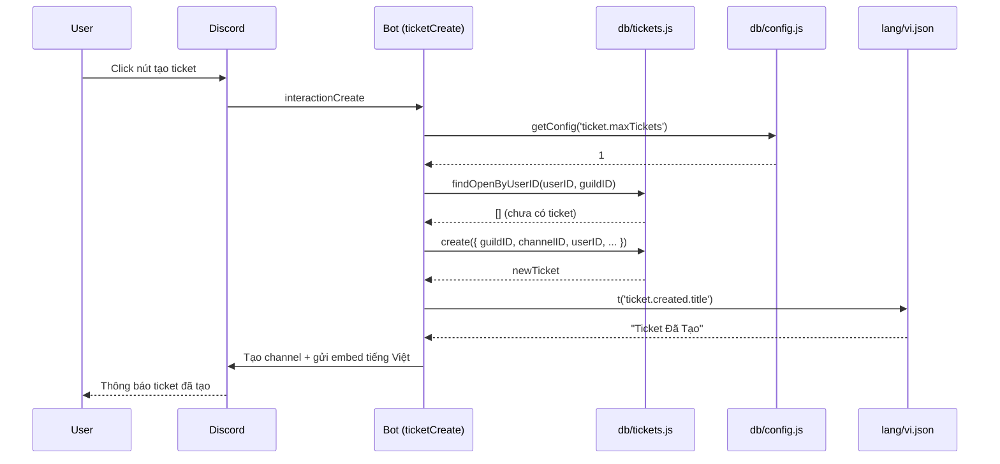

# Tài liệu Thiết kế: Việt hóa & Tái cấu trúc Bot Heiznerd-TK2

## Overview

Feature này thực hiện ba thay đổi lớn song song trên bot Discord ticket Heiznerd-TK2 (fork của Plex Tickets v2.5.2): **(1) Việt hóa toàn bộ** — tách chuỗi hiển thị ra `lang/vi.json`, thay thế section `Locale` trong `config.yml` và các chuỗi cứng trong addons; **(2) Đơn giản hóa cấu hình** — giữ tối thiểu trong file (Token, GuildID, DB path), chuyển toàn bộ cấu hình động vào SQLite và quản lý qua lệnh `/setup` + Dashboard; **(3) Chuyển từ MongoDB/Mongoose sang SQLite3** — dùng `better-sqlite3` (synchronous), định nghĩa lại toàn bộ schema, tạo lớp `db/` thay thế Mongoose models.

Mục tiêu: giữ nguyên 100% tính năng hiện có, chỉ thay đổi lớp lưu trữ, cấu hình và ngôn ngữ hiển thị. Bot dùng Discord.js v14, Node.js >= 18.

## Architecture

```mermaid
graph TD
    A[index.js] --> B[utils.js]
    A --> C[lang/vi.json]
    A --> D[config.yml - tối giản]
    B --> E[db/index.js - SQLite layer]
    E --> F[bot.db - SQLite file]
    B --> G[events/]
    B --> H[slashCommands/]
    H --> I[/setup subcommands]
    I --> E
    J[addons/Dashboard] --> E
    J --> C
    K[addons/Giveaways] --> E
    L[addons/StickyMessages] --> E
    M[addons/Vouch] --> C
```

### Luồng tạo Ticket (sau refactor)



### Cấu trúc thư mục sau refactor

```
Heiznerd-TK2/
├── config.yml              # Tối giản: Token, GuildID, DatabasePath
├── index.js
├── utils.js                # Bỏ Mongoose, dùng db/ layer
├── lang/
│   ├── index.js            # Helper t(), loadLang()
│   └── vi.json             # Toàn bộ chuỗi tiếng Việt
├── db/
│   ├── index.js            # Khởi tạo better-sqlite3, chạy migrations
│   ├── migrations.js       # Tạo bảng nếu chưa có
│   ├── config.js           # getConfig(), setConfig()
│   ├── tickets.js          # CRUD tickets
│   ├── guild.js            # Guild stats
│   ├── staffStats.js       # Staff statistics
│   ├── reviews.js          # Ticket reviews
│   ├── blacklist.js        # Blacklisted users
│   ├── panels.js           # Ticket panels
│   ├── categories.js       # Ticket categories (thay config.yml)
│   ├── suggestions.js      # Suggestions
│   ├── aiResponses.js      # AI auto responses
│   ├── giveaways.js        # Giveaways addon
│   ├── sticky.js           # Sticky messages addon
│   └── invoices.js         # PayPal + Stripe invoices
├── data/
│   └── bot.db              # SQLite database file
├── scripts/
│   └── migrate-mongo-to-sqlite.js
├── events/
├── slashCommands/
│   └── Utility/
│       └── setup.js        # MỚI: lệnh /setup
└── addons/
    ├── Dashboard/          # Thêm res.locals.t = t, Việt hóa EJS
    ├── Giveaways/          # Thay GiveawayModel → db/giveaways.js
    ├── StickyMessages/     # Thay StickyModel → db/sticky.js
    └── Vouch/              # Thêm t() cho messages
```

## Components and Interfaces

### Component 1: Hệ thống i18n (`lang/`)

**Mục đích:** Cung cấp hàm `t()` để tra cứu chuỗi tiếng Việt theo key phân cấp, hỗ trợ thay thế biến động.

**Interface:**

```javascript
// lang/index.js
interface I18n {
  t(key: string, vars?: Record<string, string>): string
  loadLang(langCode: string): void
}
```

**Triển khai:**

```javascript
// lang/index.js
const fs = require('fs');
const path = require('path');

let translations = {};

function loadLang(langCode = 'vi') {
  const filePath = path.join(__dirname, `${langCode}.json`);
  translations = JSON.parse(fs.readFileSync(filePath, 'utf8'));
}

function t(key, vars = {}) {
  const parts = key.split('.');
  let value = translations;
  for (const part of parts) {
    if (value === undefined || value === null) return key;
    value = value[part];
  }
  if (typeof value !== 'string') return key;
  return value.replace(/\{(\w+)\}/g, (_, name) => vars[name] ?? `{${name}}`);
}

loadLang('vi');
module.exports = { t, loadLang };
```

**Trách nhiệm:**
- Load file JSON ngôn ngữ khi khởi động
- Tra cứu key phân cấp (dot notation)
- Thay thế biến `{varName}` trong chuỗi
- Fallback về key nếu không tìm thấy (không throw)

**Tích hợp Dashboard EJS:**

```javascript
// addons/Dashboard/dashboard.js — middleware
const { t } = require('../../lang/index.js');
app.use((req, res, next) => {
  res.locals.t = t;
  next();
});
```

```html
<!-- views/home.ejs -->
<h1><%= t('dashboard.home.title') %></h1>
<button><%= t('ticket.close.button') %></button>
```

---

### Component 2: Database Layer (`db/`)

**Mục đích:** Thay thế toàn bộ Mongoose models bằng các module query synchronous dùng `better-sqlite3`.

**Interface chung của mỗi module:**

```javascript
// Ví dụ: db/tickets.js
interface TicketsDB {
  create(data: TicketData): Ticket
  findByChannelID(channelID: string): Ticket | null
  findOpenByUserID(userID: string, guildID: string): Ticket[]
  updateByChannelID(channelID: string, updates: Partial<Ticket>): void
  deleteByChannelID(channelID: string): void
  countOpenByGuild(guildID: string): number
}
```

**Khởi tạo (`db/index.js`):**

```javascript
const Database = require('better-sqlite3');
const path = require('path');
const fs = require('fs');
const yaml = require('js-yaml');

const config = yaml.load(fs.readFileSync('./config.yml', 'utf8'));
const dbPath = config.DatabasePath || './data/bot.db';
fs.mkdirSync(path.dirname(dbPath), { recursive: true });

const db = new Database(dbPath);
db.pragma('journal_mode = WAL');
db.pragma('foreign_keys = ON');
require('./migrations')(db);

module.exports = db;
```

**Ví dụ đầy đủ `db/tickets.js`:**

```javascript
const db = require('./index.js');

const Tickets = {
  create(data) {
    const stmt = db.prepare(`
      INSERT INTO tickets (guildID, channelID, userID, ticketType, button, msgID,
        questions, participants, ticketCreationDate, identifier, status)
      VALUES (@guildID, @channelID, @userID, @ticketType, @button, @msgID,
        @questions, @participants, @ticketCreationDate, @identifier, 'open')
    `);
    stmt.run({
      ...data,
      questions: JSON.stringify(data.questions || []),
      participants: JSON.stringify(data.participants || []),
      ticketCreationDate: new Date().toISOString(),
    });
    return Tickets.findByChannelID(data.channelID);
  },

  findByChannelID(channelID) {
    const row = db.prepare('SELECT * FROM tickets WHERE channelID = ?').get(channelID);
    return Tickets._parse(row);
  },

  findOpenByUserID(userID, guildID) {
    return db.prepare(
      "SELECT * FROM tickets WHERE userID = ? AND guildID = ? AND status = 'open'"
    ).all(userID, guildID).map(Tickets._parse);
  },

  updateByChannelID(channelID, updates) {
    // Serialize JSON fields nếu cần
    const serialized = { ...updates };
    if (serialized.questions) serialized.questions = JSON.stringify(serialized.questions);
    if (serialized.participants) serialized.participants = JSON.stringify(serialized.participants);
    const fields = Object.keys(serialized).map(k => `${k} = @${k}`).join(', ');
    db.prepare(`UPDATE tickets SET ${fields}, updatedAt = datetime('now') WHERE channelID = @channelID`)
      .run({ ...serialized, channelID });
  },

  deleteByChannelID(channelID) {
    db.prepare('DELETE FROM tickets WHERE channelID = ?').run(channelID);
  },

  countOpenByGuild(guildID) {
    return db.prepare(
      "SELECT COUNT(*) as cnt FROM tickets WHERE guildID = ? AND status = 'open'"
    ).get(guildID).cnt;
  },

  _parse(row) {
    if (!row) return null;
    return {
      ...row,
      questions: JSON.parse(row.questions || '[]'),
      participants: JSON.parse(row.participants || '[]'),
      claimed: Boolean(row.claimed),
      archived: Boolean(row.archived),
      inactivityWarningSent: Boolean(row.inactivityWarningSent),
    };
  }
};

module.exports = Tickets;
```

---

### Component 3: Config động (`db/config.js`)

**Mục đích:** Lưu và đọc cấu hình bot từ SQLite thay vì `config.yml`.

**Interface:**

```javascript
interface ConfigDB {
  getConfig(key: string, defaultValue?: any): any
  setConfig(key: string, value: any): void
  getAllConfig(): Record<string, any>
}
```

**Triển khai:**

```javascript
// db/config.js
const db = require('./index.js');

function getConfig(key, defaultValue = null) {
  const row = db.prepare('SELECT value FROM guild_config WHERE key = ?').get(key);
  if (!row) return defaultValue;
  try { return JSON.parse(row.value); } catch { return row.value; }
}

function setConfig(key, value) {
  const json = JSON.stringify(value);
  db.prepare(
    'INSERT INTO guild_config (key, value) VALUES (?, ?) ' +
    'ON CONFLICT(key) DO UPDATE SET value = excluded.value'
  ).run(key, json);
}

function getAllConfig() {
  const rows = db.prepare('SELECT key, value FROM guild_config').all();
  const result = {};
  for (const row of rows) {
    try { result[row.key] = JSON.parse(row.value); } catch { result[row.key] = row.value; }
  }
  return result;
}

module.exports = { getConfig, setConfig, getAllConfig };
```

---

### Component 4: Lệnh `/setup`

**Mục đích:** Cho phép admin cấu hình bot trực tiếp qua Discord slash commands thay vì sửa file.

**Interface lệnh:**

```javascript
// slashCommands/Utility/setup.js
{
  name: 'setup',
  description: 'Cấu hình bot (chỉ dành cho Admin)',
  defaultMemberPermissions: PermissionFlagsBits.Administrator,
  options: [
    {
      name: 'ticket',
      type: SubcommandGroup,
      description: 'Cấu hình cài đặt ticket',
      options: [
        { name: 'maxtickets', type: Subcommand, options: [{ name: 'value', type: Integer }] },
        { name: 'deletetime', type: Subcommand, options: [{ name: 'seconds', type: Integer }] },
        { name: 'logschannel', type: Subcommand, options: [{ name: 'channel', type: Channel }] },
        { name: 'cooldown', type: Subcommand, options: [{ name: 'seconds', type: Integer }] },
      ]
    },
    {
      name: 'category',
      type: SubcommandGroup,
      description: 'Quản lý danh mục ticket',
      options: [
        { name: 'create', type: Subcommand },
        { name: 'edit', type: Subcommand, options: [{ name: 'id', type: String }] },
        { name: 'delete', type: Subcommand, options: [{ name: 'id', type: String }] },
        { name: 'list', type: Subcommand },
      ]
    },
    {
      name: 'panel',
      type: SubcommandGroup,
      description: 'Quản lý panel ticket',
      options: [
        { name: 'create', type: Subcommand },
        { name: 'send', type: Subcommand, options: [
          { name: 'panel_id', type: String },
          { name: 'channel', type: Channel }
        ]},
      ]
    },
    {
      name: 'claiming',
      type: SubcommandGroup,
      description: 'Cấu hình hệ thống nhận ticket'
    },
    {
      name: 'workinghours',
      type: SubcommandGroup,
      description: 'Cấu hình giờ làm việc'
    }
  ]
}
```

---

### Component 5: Migration Script

**Mục đích:** Chuyển dữ liệu từ MongoDB sang SQLite một lần duy nhất.

**Interface:**

```javascript
// scripts/migrate-mongo-to-sqlite.js
async function migrate(mongoURI: string): Promise<void>
// Chạy: MONGO_URI=... node scripts/migrate-mongo-to-sqlite.js
```

**Triển khai (pattern chính):**

```javascript
async function migrate() {
  await mongoose.connect(process.env.MONGO_URI);

  // Dùng transaction để đảm bảo atomicity
  const insertTickets = db.transaction((tickets) => {
    for (const t of tickets) {
      db.prepare(`INSERT OR IGNORE INTO tickets (...) VALUES (...)`).run({
        ...mapTicketFields(t),
        questions: JSON.stringify(t.questions || []),
        participants: JSON.stringify(t.participants || []),
      });
    }
  });

  const tickets = await OldTicketModel.find({}).lean();
  insertTickets(tickets);
  console.log(`✅ Migrated ${tickets.length} tickets`);

  // Tương tự cho guild_stats, staff_stats, reviews, blacklist...
  await mongoose.disconnect();
}
```

## Data Models

### Model 1: `tickets` (SQLite)

```sql
CREATE TABLE IF NOT EXISTS tickets (
  id                      INTEGER PRIMARY KEY AUTOINCREMENT,
  guildID                 TEXT NOT NULL,
  channelID               TEXT UNIQUE NOT NULL,
  userID                  TEXT NOT NULL,
  ticketType              TEXT,
  button                  TEXT,
  msgID                   TEXT,
  claimed                 INTEGER DEFAULT 0,
  claimUser               TEXT,
  messages                INTEGER DEFAULT 0,
  lastMessageSent         TEXT,
  status                  TEXT DEFAULT 'open',
  closeUserID             TEXT,
  questions               TEXT DEFAULT '[]',
  participants            TEXT DEFAULT '[]',
  ticketCreationDate      TEXT,
  closedAt                TEXT,
  identifier              TEXT,
  closeReason             TEXT DEFAULT 'Không có lý do.',
  closeNotificationTime   INTEGER,
  closeNotificationMsgID  TEXT,
  closeNotificationUserID TEXT,
  transcriptID            TEXT,
  priority                TEXT,
  priorityName            TEXT,
  waitingReplyFrom        TEXT,
  firstStaffResponse      TEXT,
  inactivityWarningSent   INTEGER DEFAULT 0,
  priorityCooldown        TEXT,
  originalCategoryID      TEXT,
  archived                INTEGER DEFAULT 0,
  archivedBy              TEXT,
  archivedAt              INTEGER,
  archiveMsgID            TEXT,
  aiSummary               TEXT,
  createdAt               TEXT DEFAULT (datetime('now')),
  updatedAt               TEXT DEFAULT (datetime('now'))
);
CREATE INDEX IF NOT EXISTS idx_tickets_guildID ON tickets(guildID);
CREATE INDEX IF NOT EXISTS idx_tickets_userID ON tickets(userID);
CREATE INDEX IF NOT EXISTS idx_tickets_status ON tickets(status);
```

**Quy tắc validation:**
- `channelID` là UNIQUE — mỗi channel Discord chỉ có 1 ticket
- `status` ∈ `{'open', 'closed', 'archived'}`
- `questions` và `participants` lưu dưới dạng JSON string (mảng)
- `claimed`, `archived`, `inactivityWarningSent` là BOOLEAN (0/1)

---

### Model 2: `guild_stats` (SQLite)

```sql
CREATE TABLE IF NOT EXISTS guild_stats (
  guildID                   TEXT PRIMARY KEY,
  totalTickets              INTEGER DEFAULT 0,
  openTickets               INTEGER DEFAULT 0,
  totalClaims               INTEGER DEFAULT 0,
  totalMessages             INTEGER DEFAULT 0,
  totalSuggestions          INTEGER DEFAULT 0,
  totalSuggestionUpvotes    INTEGER DEFAULT 0,
  totalSuggestionDownvotes  INTEGER DEFAULT 0,
  totalReviews              INTEGER DEFAULT 0,
  averageRating             REAL DEFAULT 0,
  timesBotStarted           INTEGER DEFAULT 0,
  averageCompletion         TEXT,
  averageResponse           TEXT
);
```

---

### Model 3: `staff_stats` (SQLite)

```sql
CREATE TABLE IF NOT EXISTS staff_stats (
  id                  INTEGER PRIMARY KEY AUTOINCREMENT,
  userID              TEXT UNIQUE NOT NULL,
  username            TEXT,
  avatarURL           TEXT,
  totalMessages       INTEGER DEFAULT 0,
  totalClaims         INTEGER DEFAULT 0,
  totalClosedTickets  INTEGER DEFAULT 0,
  averageResponseTime REAL DEFAULT 0,
  lastActive          TEXT,
  totalRatings        INTEGER DEFAULT 0,
  totalRatingScore    REAL DEFAULT 0,
  averageRating       REAL DEFAULT 0,
  weekly              TEXT DEFAULT '[]',
  monthly             TEXT DEFAULT '[]',
  yearly              TEXT DEFAULT '[]',
  ticketsHistory      TEXT DEFAULT '[]'
);
```

**Quy tắc validation:**
- `weekly`, `monthly`, `yearly`, `ticketsHistory` lưu JSON array
- Mỗi phần tử `weekly[]` có dạng: `{weekNumber, year, messages, claims, closedTickets, ...}`

---

### Model 4: `reviews` (SQLite)

```sql
CREATE TABLE IF NOT EXISTS reviews (
  id                  INTEGER PRIMARY KEY AUTOINCREMENT,
  ticketCreatorID     TEXT,
  guildID             TEXT,
  ticketChannelID     TEXT,
  userID              TEXT,
  tCloseLogMsgID      TEXT,
  tCloseLogChannelID  TEXT,
  reviewDMUserMsgID   TEXT,
  rating              INTEGER,
  reviewMessage       TEXT,
  category            TEXT,
  totalMessages       INTEGER,
  transcriptID        TEXT,
  alreadyRated        INTEGER DEFAULT 0,
  createdAt           TEXT DEFAULT (datetime('now')),
  updatedAt           TEXT DEFAULT (datetime('now'))
);
```

**Quy tắc validation:**
- `rating` ∈ `{1, 2, 3, 4, 5}`
- `alreadyRated` là BOOLEAN (0/1)

---

### Model 5: `blacklisted_users` (SQLite)

```sql
CREATE TABLE IF NOT EXISTS blacklisted_users (
  userId      TEXT PRIMARY KEY,
  blacklisted INTEGER DEFAULT 1,
  createdAt   TEXT DEFAULT (datetime('now')),
  updatedAt   TEXT DEFAULT (datetime('now'))
);
```

---

### Model 6: `ticket_panels` (SQLite)

```sql
CREATE TABLE IF NOT EXISTS ticket_panels (
  id                INTEGER PRIMARY KEY AUTOINCREMENT,
  guildID           TEXT NOT NULL,
  panelId           TEXT NOT NULL,
  msgID             TEXT NOT NULL,
  selectMenuOptions TEXT DEFAULT '[]',
  createdAt         TEXT DEFAULT (datetime('now')),
  updatedAt         TEXT DEFAULT (datetime('now')),
  UNIQUE(guildID, panelId)
);
```

---

### Model 7: `ticket_categories` (SQLite — MỚI, thay thế config.yml)

```sql
CREATE TABLE IF NOT EXISTS ticket_categories (
  id                  INTEGER PRIMARY KEY AUTOINCREMENT,
  categoryKey         TEXT UNIQUE NOT NULL,
  categoryName        TEXT NOT NULL,
  description         TEXT DEFAULT '',
  parentCategoryID    TEXT NOT NULL,
  embedTitle          TEXT,
  embedMessage        TEXT,
  categoryEmoji       TEXT DEFAULT '',
  buttonColor         TEXT DEFAULT 'Green',
  supportRoles        TEXT DEFAULT '[]',
  mentionSupportRoles INTEGER DEFAULT 0,
  channelName         TEXT DEFAULT 'ticket-{username}',
  logsChannelID       TEXT DEFAULT '',
  requiredRoles       TEXT DEFAULT '[]',
  questions           TEXT DEFAULT '[]',
  sortOrder           INTEGER DEFAULT 0,
  enabled             INTEGER DEFAULT 1
);
```

**Quy tắc validation:**
- `buttonColor` ∈ `{'Blurple', 'Gray', 'Green', 'Red'}`
- `supportRoles`, `requiredRoles`, `questions` lưu JSON array
- `categoryName` tối đa 80 ký tự (giới hạn Discord button)

---

### Model 8: `guild_config` (SQLite — Config động)

```sql
CREATE TABLE IF NOT EXISTS guild_config (
  key   TEXT PRIMARY KEY,
  value TEXT NOT NULL
);
```

**Các key quan trọng:**

| Key | Kiểu | Mô tả |
|-----|------|-------|
| `ticket.maxTickets` | number | Số ticket tối đa mỗi người |
| `ticket.deleteTime` | number | Giây trước khi xóa ticket |
| `ticket.logsChannelID` | string | Kênh log mặc định |
| `ticket.cooldown` | number | Cooldown tạo ticket (giây) |
| `claiming.enabled` | boolean | Bật/tắt hệ thống nhận ticket |
| `claiming.maxPerStaff` | number | Số ticket tối đa mỗi staff |
| `workingHours.enabled` | boolean | Bật/tắt giờ làm việc |
| `workingHours.timezone` | string | Timezone (VD: Asia/Ho_Chi_Minh) |
| `workingHours.schedule` | object | Lịch làm việc theo ngày |
| `review.enabled` | boolean | Bật/tắt hệ thống đánh giá |
| `embedColor` | string | Màu embed mặc định (hex) |

---

### Model 9: `suggestions` (SQLite)

```sql
CREATE TABLE IF NOT EXISTS suggestions (
  id         INTEGER PRIMARY KEY AUTOINCREMENT,
  msgID      TEXT UNIQUE,
  userID     TEXT,
  suggestion TEXT,
  upVotes    INTEGER DEFAULT 0,
  downVotes  INTEGER DEFAULT 0,
  status     TEXT DEFAULT 'pending',
  voters     TEXT DEFAULT '[]'
);
```

---

### Model 10: `giveaways` (SQLite — Addon)

```sql
CREATE TABLE IF NOT EXISTS giveaways (
  id                INTEGER PRIMARY KEY AUTOINCREMENT,
  messageId         TEXT UNIQUE NOT NULL,
  channelId         TEXT NOT NULL,
  startedBy         TEXT NOT NULL,
  prize             TEXT NOT NULL,
  winners           INTEGER NOT NULL,
  endTime           INTEGER NOT NULL,
  entrants          TEXT DEFAULT '[]',
  status            TEXT DEFAULT 'active',
  minServerJoinDate TEXT,
  minJoinDurationMs INTEGER DEFAULT 0
);
```

---

### Model 11: `sticky_messages` (SQLite — Addon)

```sql
CREATE TABLE IF NOT EXISTS sticky_messages (
  channelId TEXT PRIMARY KEY,
  message   TEXT NOT NULL,
  msgCount  INTEGER DEFAULT 0
);
```

---

### Model 12: `invoices` (SQLite — PayPal + Stripe hợp nhất)

```sql
CREATE TABLE IF NOT EXISTS invoices (
  id         INTEGER PRIMARY KEY AUTOINCREMENT,
  type       TEXT NOT NULL,
  guildID    TEXT,
  channelID  TEXT,
  userID     TEXT,
  sellerID   TEXT,
  service    TEXT,
  amount     REAL,
  currency   TEXT,
  status     TEXT DEFAULT 'UNPAID',
  invoiceID  TEXT,
  invoiceURL TEXT,
  createdAt  TEXT DEFAULT (datetime('now'))
);
```

---

### Cấu trúc `lang/vi.json` (trích)

```json
{
  "ticket": {
    "created": { "title": "Ticket Đã Tạo", "msg": "Ticket của bạn đã được tạo tại" },
    "close": {
      "button": "Đóng Ticket",
      "title": "Nhật ký Ticket | Ticket Đã Đóng",
      "deleting": "Đang xóa ticket sau {time} giây",
      "autoClose": "Tự động đóng do không hoạt động"
    },
    "claim": {
      "button": "Nhận ticket",
      "unclaimButton": "Trả ticket",
      "claimed": "Ticket này đã được nhận bởi {user}\nHọ sẽ hỗ trợ bạn ngay!"
    },
    "blacklist": {
      "blacklistedTitle": "Bị Chặn",
      "blacklistedMsg": "Bạn đã bị chặn tạo ticket!"
    }
  },
  "review": {
    "totalReviews": "Tổng đánh giá:",
    "averageRating": "Đánh giá trung bình:",
    "thankYou": "Cảm ơn bạn đã để lại đánh giá!"
  },
  "stats": {
    "totalTickets": "Tổng Ticket:",
    "openTickets": "Ticket Đang Mở:",
    "guildStats": "Thống kê Server"
  },
  "suggestion": {
    "submit": "Đề xuất của bạn đã được gửi, cảm ơn!",
    "newTitle": "💡 Đề xuất mới"
  }
}
```

## Correctness Properties

### Property 1: Tính nhất quán của i18n

Với mọi key `k` tồn tại trong `vi.json`, hàm `t(k)` không bao giờ trả về `undefined` hoặc `null`:

```javascript
// fast-check property test
fc.assert(fc.property(
  fc.constantFrom(...Object.keys(flattenKeys(viJson))),
  (key) => {
    const result = t(key);
    return typeof result === 'string' && result.length > 0;
  }
));
```

### Property 2: Tính idempotent của setConfig/getConfig

Với mọi cặp `(key, value)` hợp lệ, `setConfig(k, v)` rồi `getConfig(k)` luôn trả về `v`:

```javascript
fc.assert(fc.property(
  fc.string({ minLength: 1 }),
  fc.oneof(fc.string(), fc.integer(), fc.boolean()),
  (key, value) => {
    setConfig(key, value);
    return JSON.stringify(getConfig(key)) === JSON.stringify(value);
  }
));
```

### Property 3: Tính nhất quán của Tickets CRUD

Với mọi ticket data hợp lệ, sau khi `create()` thì `findByChannelID()` trả về đúng object:

```javascript
fc.assert(fc.property(
  fc.record({
    guildID: fc.string({ minLength: 1 }),
    channelID: fc.uuid(),
    userID: fc.string({ minLength: 1 }),
  }),
  (data) => {
    const ticket = Tickets.create(data);
    const found = Tickets.findByChannelID(data.channelID);
    return found !== null && found.channelID === data.channelID;
  }
));
```

### Property 4: Tính toàn vẹn của JSON serialization

Với mọi mảng `questions[]` hoặc `participants[]`, sau khi lưu vào SQLite và đọc lại, dữ liệu không bị mất:

```javascript
fc.assert(fc.property(
  fc.array(fc.record({ customId: fc.string(), question: fc.string() })),
  (questions) => {
    const channelID = randomUUID();
    Tickets.create({ ..., channelID, questions });
    const found = Tickets.findByChannelID(channelID);
    return JSON.stringify(found.questions) === JSON.stringify(questions);
  }
));
```

### Property 5: Tính đúng đắn của đếm ticket mở

`countOpenByGuild(guildID)` luôn bằng số lượng ticket có `status = 'open'` trong guild đó:

```javascript
// Invariant: countOpenByGuild(g) === findOpenByUserID(*, g).length (tổng tất cả users)
const count = Tickets.countOpenByGuild(guildID);
const allOpen = db.prepare(
  "SELECT COUNT(*) as c FROM tickets WHERE guildID = ? AND status = 'open'"
).get(guildID).c;
assert(count === allOpen);
```

## Error Handling

### Lỗi 1: Key i18n không tồn tại

**Điều kiện:** `t('key.khong.ton.tai')` được gọi với key không có trong `vi.json`

**Phản hồi:** Trả về chính key đó dưới dạng string (không throw, không crash)

**Phục hồi:** Log warning để phát hiện key bị thiếu trong quá trình dev

```javascript
function t(key, vars = {}) {
  // ...
  if (typeof value !== 'string') {
    if (process.env.NODE_ENV === 'development') {
      console.warn(`[i18n] Missing key: ${key}`);
    }
    return key; // fallback
  }
  // ...
}
```

---

### Lỗi 2: Database không khởi động được

**Điều kiện:** File `bot.db` bị khóa, không có quyền ghi, hoặc đường dẫn không hợp lệ

**Phản hồi:** Bot log lỗi rõ ràng và thoát với exit code 1

**Phục hồi:** Kiểm tra `DatabasePath` trong `config.yml`, đảm bảo thư mục `data/` có quyền ghi

```javascript
// db/index.js
let db;
try {
  db = new Database(dbPath);
} catch (err) {
  console.error(`[DB ERROR] Không thể mở database tại ${dbPath}:`, err.message);
  process.exit(1);
}
```

---

### Lỗi 3: JSON parse lỗi trong TEXT column

**Điều kiện:** Dữ liệu trong cột `questions` hoặc `participants` bị corrupt (không phải JSON hợp lệ)

**Phản hồi:** Trả về mảng rỗng `[]` thay vì throw

**Phục hồi:** Log warning với channelID để admin có thể kiểm tra

```javascript
_parse(row) {
  if (!row) return null;
  let questions = [];
  try { questions = JSON.parse(row.questions || '[]'); }
  catch { console.warn(`[DB] JSON parse lỗi cho ticket ${row.channelID}`); }
  return { ...row, questions };
}
```

---

### Lỗi 4: Config key không tồn tại

**Điều kiện:** `getConfig('key.chua.co')` được gọi trước khi `/setup` được chạy

**Phản hồi:** Trả về `defaultValue` (mặc định `null`)

**Phục hồi:** Mỗi lần đọc config nên truyền giá trị mặc định hợp lý

```javascript
const maxTickets = getConfig('ticket.maxTickets', 1); // fallback = 1
```

---

### Lỗi 5: Migration thất bại giữa chừng

**Điều kiện:** Kết nối MongoDB mất, hoặc SQLite đầy disk trong quá trình migration

**Phản hồi:** Transaction rollback, không có dữ liệu nào bị ghi một phần

**Phục hồi:** Chạy lại migration script (dùng `INSERT OR IGNORE` để bỏ qua bản ghi đã tồn tại)

---

### Lỗi 6: better-sqlite3 block event loop

**Điều kiện:** Query nặng (full-table scan) chạy trong event handler tần suất cao (`messageCreate`)

**Phản hồi:** Bot phản hồi chậm, Discord timeout interaction

**Phục hồi:** Luôn dùng index và query có điều kiện cụ thể; tránh `SELECT *` không có `WHERE`

```javascript
// ❌ Tránh
const all = db.prepare('SELECT * FROM tickets').all();

// ✅ Dùng index
const ticket = db.prepare(
  'SELECT id, claimed, claimUser FROM tickets WHERE channelID = ? AND status = ?'
).get(channelID, 'open');
```

## Testing Strategy

### Unit Testing

**Framework:** Jest hoặc Node.js built-in `node:test`

**Phạm vi:**
- `lang/index.js`: Test `t()` với key hợp lệ, key không tồn tại, biến thay thế, key lồng nhau
- `db/config.js`: Test `getConfig()` / `setConfig()` với string, number, boolean, object
- `db/tickets.js`: Test CRUD với database in-memory (`:memory:`)
- `db/staffStats.js`: Test serialize/deserialize JSON arrays (weekly, monthly, yearly)

**Ví dụ test:**

```javascript
// tests/lang.test.js
const { t, loadLang } = require('../lang/index.js');

describe('t() helper', () => {
  test('trả về chuỗi đúng cho key hợp lệ', () => {
    expect(t('ticket.close.button')).toBe('Đóng Ticket');
  });

  test('thay thế biến {time}', () => {
    expect(t('ticket.close.deleting', { time: '5' })).toBe('Đang xóa ticket sau 5 giây');
  });

  test('fallback về key nếu không tìm thấy', () => {
    expect(t('key.khong.ton.tai')).toBe('key.khong.ton.tai');
  });
});

// tests/db-tickets.test.js
const Database = require('better-sqlite3');
const db = new Database(':memory:');
// ... setup schema, test CRUD
```

---

### Property-Based Testing

**Framework:** `fast-check`

**Các property cần test:**

1. `t(k)` không bao giờ trả về `undefined` với mọi key trong `vi.json`
2. `setConfig(k, v)` → `getConfig(k)` luôn trả về `v` (idempotent)
3. `Tickets.create(data)` → `findByChannelID(data.channelID)` luôn tìm thấy
4. JSON arrays (questions, participants) không bị mất sau serialize/deserialize
5. `countOpenByGuild()` luôn nhất quán với số bản ghi thực tế

---

### Integration Testing

**Phạm vi:**
- Luồng tạo ticket end-to-end với Discord.js mock
- Luồng đóng ticket: cập nhật status, gửi DM, tạo transcript
- Lệnh `/setup ticket maxtickets` → `getConfig('ticket.maxTickets')` trả về giá trị mới
- Dashboard load trang với `res.locals.t` hoạt động đúng

---

### Kiểm tra thủ công

- Chạy bot trên server test, tạo ticket và kiểm tra tất cả text hiển thị bằng tiếng Việt
- Dùng `/setup` để thay đổi config và xác nhận thay đổi có hiệu lực ngay
- Kiểm tra Dashboard: tất cả label, button, thông báo hiển thị tiếng Việt
- Chạy migration script với dữ liệu MongoDB thật và so sánh số lượng bản ghi

## Dependencies

### Thêm mới

| Package | Phiên bản | Lý do |
|---------|-----------|-------|
| `better-sqlite3` | `^9.4.3` | Thay thế Mongoose, synchronous API |
| `connect-sqlite3` | `^0.9.15` | Session store cho Express Dashboard (thay connect-mongo) |

### Xóa bỏ

| Package | Lý do |
|---------|-------|
| `mongoose` | Thay bằng better-sqlite3 |
| `connect-mongo` | Session store MongoDB, thay bằng connect-sqlite3 |

### Giữ nguyên

Tất cả các package còn lại trong `package.json` hiện tại giữ nguyên phiên bản.

---

## Rủi ro & Giảm thiểu

| Rủi ro | Mức độ | Giảm thiểu |
|--------|--------|------------|
| Mất dữ liệu khi migration | Cao | Backup MongoDB trước; migration dùng transaction + `INSERT OR IGNORE` |
| better-sqlite3 block event loop | Trung bình | Dùng index, tránh full-table scan trong hot path |
| Key i18n bị thiếu | Thấp | `t()` fallback về key; dễ phát hiện khi test |
| Config động không tương thích | Trung bình | `getConfig()` có `defaultValue`; wrapper tương thích với code cũ |
| Dashboard session hỏng sau đổi store | Thấp | Người dùng chỉ cần đăng nhập lại một lần |
