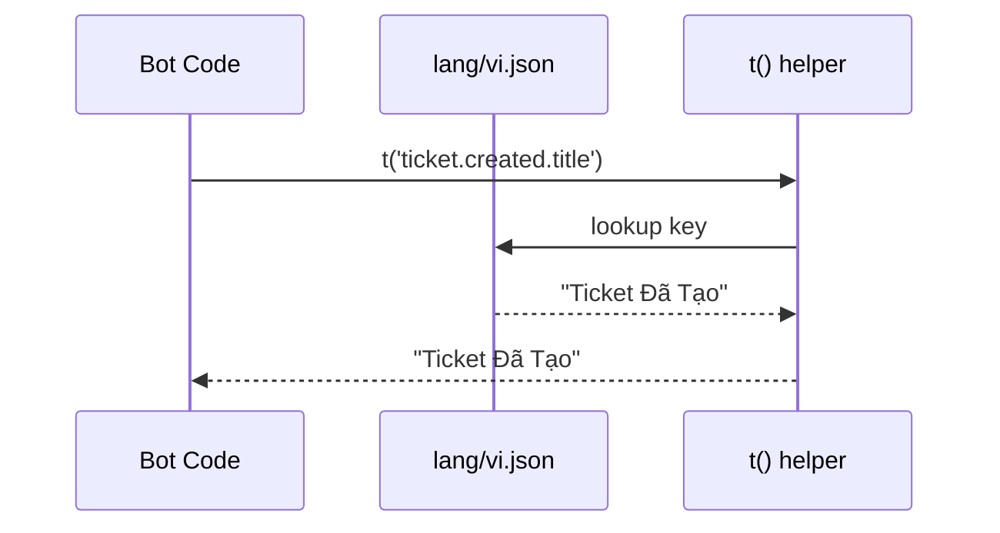
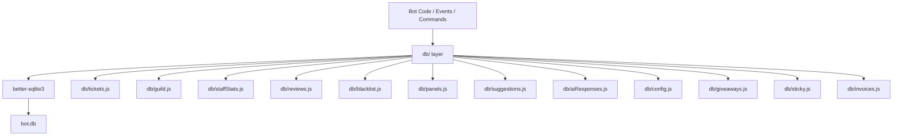
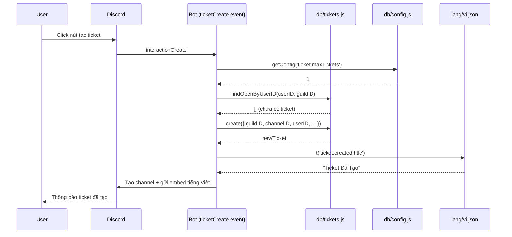

# Tài liệu Thiết kế: Việt hóa & Tái cấu trúc Bot Heiznerd-TK2

## Tổng quan

Feature này thực hiện ba thay đổi lớn song song trên bot Discord ticket Heiznerd-TK2 (fork của Plex Tickets v2.5.2):

1. **Việt hóa toàn bộ** — Tách toàn bộ chuỗi hiển thị ra file `lang/vi.json`, thay thế section `Locale` trong `config.yml` và các chuỗi cứng trong addons.
2. **Đơn giản hóa cấu hình** — Giữ lại tối thiểu trong file (Token, GuildID, DB path), chuyển toàn bộ cấu hình động vào SQLite và quản lý qua lệnh `/setup` + Dashboard.
3. **Chuyển từ MongoDB/Mongoose sang SQLite3** — Dùng `better-sqlite3` (synchronous), định nghĩa lại toàn bộ schema, tạo lớp `db/` thay thế Mongoose models.

Mục tiêu: giữ nguyên 100% tính năng hiện có, chỉ thay đổi lớp lưu trữ, cấu hình và ngôn ngữ hiển thị.

---

## Kiến trúc tổng thể

```mermaid
graph TD
    A[index.js] --> B[utils.js]
    A --> C[lang/vi.json]
    A --> D[config.yml - tối giản]
    B --> E[db/index.js - SQLite layer]
    E --> F[bot.db - SQLite file]
    B --> G[events/]
    B --> H[slashCommands/]
    H --> I[/setup subcommands]
    I --> E
    J[addons/Dashboard] --> E
    J --> C
    K[addons/Giveaways] --> E
    L[addons/StickyMessages] --> E
    M[addons/Vouch] --> C
```

---

## Phần 1: Hệ thống Việt hóa (i18n)

### 1.1 Kiến trúc i18n



### 1.2 Cấu trúc file `lang/vi.json`

File được tổ chức theo namespace phân cấp để dễ tìm kiếm và bảo trì:

```json
{
  "common": {
    "noPerms": "Bạn không có quyền sử dụng lệnh này!",
    "notInTicket": "Bạn không ở trong kênh ticket!",
    "reason": "Lý do",
    "error": "Đã xảy ra lỗi, vui lòng thử lại."
  },
  "ticket": {
    "created": {
      "title": "Ticket Đã Tạo",
      "msg": "Ticket của bạn đã được tạo tại"
    },
    "close": {
      "button": "Đóng Ticket",
      "title": "Nhật ký Ticket | Ticket Đã Đóng",
      "deleting": "Đang xóa ticket sau {time} giây",
      "reason": "Lý do đóng ticket",
      "reasonTitle": "Lý do đóng",
      "whyClose": "Tại sao bạn đóng ticket này?",
      "restrictClose": "Bạn không được phép đóng ticket này!",
      "autoClose": "Tự động đóng do không hoạt động"
    },
    "claim": {
      "button": "Nhận ticket",
      "unclaimButton": "Trả ticket",
      "claimedBy": "Được nhận bởi",
      "unclaimedBy": "Được trả bởi",
      "claimedTitle": "Ticket Đã Được Nhận",
      "unclaimedTitle": "Ticket Đã Được Trả",
      "notClaimed": "Ticket này chưa được nhận!",
      "claimed": "Ticket này đã được nhận bởi {user}\nHọ sẽ hỗ trợ bạn ngay!",
      "unclaimed": "Ticket này đã được trả bởi {user}",
      "didntClaim": "Bạn không nhận ticket này, chỉ người nhận mới có thể trả! ({user})",
      "claimedLog": "Nhật ký Ticket | Ticket Đã Nhận",
      "unclaimedLog": "Nhật ký Ticket | Ticket Đã Trả",
      "claimMsg": "Bạn đã nhận ticket thành công!",
      "unclaimMsg": "Bạn đã trả ticket thành công!",
      "restrictClaim": "Bạn không được phép nhận ticket này!",
      "claimDetails": "Chi tiết nhận ticket",
      "unclaimDetails": "Chi tiết trả ticket",
      "autoClaimedNote": "Ghi chú"
    },
    "blacklist": {
      "alreadyBlacklisted": "{user} đã bị chặn rồi!",
      "successBlacklisted": "{user} đã bị **chặn** tạo ticket thành công!",
      "notBlacklisted": "{user} không bị chặn!",
      "successUnblacklisted": "{user} đã được **bỏ chặn** tạo ticket thành công!",
      "blacklistedTitle": "Bị Chặn",
      "blacklistedMsg": "Bạn đã bị chặn tạo ticket!",
      "roleBlacklistedTitle": "Vai trò bị chặn",
      "roleBlacklistedMsg": "Vai trò của bạn bị chặn tạo ticket!"
    },
    "open": {
      "alreadyOpenTitle": "Ticket Đang Mở",
      "alreadyOpenMsg": "Bạn chỉ được mở tối đa **{max} ticket** cùng lúc.",
      "selectCategory": "Chọn danh mục...",
      "requiredRoleMissing": "Bạn không có vai trò cần thiết để mở ticket trong danh mục này!",
      "requiredRoleTitle": "Cần Vai Trò",
      "cooldownTitle": "Thời gian chờ",
      "cooldownMsg": "Bạn phải chờ {time} trước khi tạo ticket mới!"
    },
    "info": {
      "category": "Danh mục",
      "details": "Chi tiết Ticket",
      "participants": "Người tham gia",
      "userDetails": "Thông tin người dùng",
      "totalMessages": "Tổng tin nhắn:",
      "transcriptCategory": "Danh mục"
    },
    "user": {
      "add": "Đã thêm **{user} ({username})** vào ticket.",
      "remove": "Đã xóa **{user} ({username})** khỏi ticket.",
      "addTitle": "Nhật ký Ticket | Thêm Người Dùng",
      "removeTitle": "Nhật ký Ticket | Xóa Người Dùng",
      "leftTitle": "Người Dùng Rời Server",
      "leftDesc": "Người tạo ticket đã rời server **({username})**"
    },
    "rename": {
      "renamed": "Ticket này đã được đổi tên thành **{newName}**!",
      "title": "Nhật ký Ticket | Đổi Tên Ticket",
      "oldName": "Tên cũ",
      "newName": "Tên mới",
      "details": "Chi tiết đổi tên"
    },
    "reopen": {
      "button": "Mở lại",
      "reopenedBy": "Ticket này đã được mở lại bởi {user} ({username})"
    },
    "delete": {
      "button": "Xóa",
      "notAllowed": "Bạn không được phép xóa ticket này!",
      "forceDeleted": "Ticket Bị Xóa Bắt Buộc"
    },
    "pin": {
      "pinned": "📌 Ticket này đã được ghim!",
      "alreadyPinned": "Ticket này đã được ghim rồi!"
    },
    "logs": {
      "executor": "Người thực hiện",
      "ticket": "Ticket",
      "user": "Người dùng",
      "ticketAuthor": "Người tạo ticket",
      "closedBy": "Đóng bởi",
      "deletedBy": "Xóa bởi",
      "totalMessages": "Tổng tin nhắn:"
    },
    "closeDM": {
      "ticketInfo": "• Thông tin Ticket",
      "category": "Danh mục:",
      "claimedBy": "Được nhận bởi:",
      "closed": "Ticket Đã Đóng",
      "notClaimed": "Chưa được nhận",
      "closeReason": "Lý do đóng"
    },
    "transcript": {
      "button": "Transcript",
      "title": "📝 Transcript Ticket",
      "description": "Transcript cho ticket **#{identifier}** đã được tạo.",
      "footer": "Tạo bởi {user}",
      "failed": "Không thể tạo transcript. Ticket có thể chưa đủ tin nhắn.",
      "error": "Đã xảy ra lỗi khi tạo transcript. Vui lòng thử lại.",
      "logTitle": "Nhật ký Ticket | Transcript Đã Tạo",
      "details": "Chi tiết Transcript",
      "viewButton": "Xem Transcript",
      "dmClickhere": "Nhấn vào đây để xem transcript"
    },
    "questions": {
      "notAnswered": "Chưa trả lời",
      "success": "Cảm ơn bạn đã trả lời các câu hỏi!"
    }
  },
  "review": {
    "selectReview": "Chọn đánh giá...",
    "explainWhy": "Vui lòng giải thích lý do bạn đưa ra đánh giá này",
    "stats": "Đánh giá",
    "totalReviews": "Tổng đánh giá:",
    "averageRating": "Đánh giá trung bình:",
    "rated": "> Bạn đã đánh giá ticket này: {star} ({rating}/5)",
    "reviewed": "> Bạn đã đánh giá ticket này: {star} ({rating}/5)\n> Nhận xét: {reviewMessage}",
    "thankYou": "Cảm ơn bạn đã để lại đánh giá!",
    "ticketRating": "Đánh giá Ticket"
  },
  "stats": {
    "totalTickets": "Tổng Ticket:",
    "openTickets": "Ticket Đang Mở:",
    "totalClaims": "Tổng Nhận:",
    "guildStats": "Thống kê Server",
    "tickets": "Tickets",
    "avgCompletion": "Thời gian hoàn thành TB:",
    "avgResponse": "Thời gian phản hồi TB:"
  },
  "suggestion": {
    "submit": "Đề xuất của bạn đã được gửi, cảm ơn!",
    "title": "Đề xuất",
    "statsTitle": "Đề xuất",
    "total": "Tổng đề xuất:",
    "totalUpvotes": "Tổng lượt thích:",
    "totalDownvotes": "Tổng lượt không thích:",
    "information": "Thông tin",
    "upvotes": "Lượt thích:",
    "downvotes": "Lượt không thích:",
    "from": "Từ:",
    "status": "Trạng thái:",
    "newTitle": "💡 Đề xuất mới",
    "voteResetTitle": "Đặt lại bình chọn",
    "voteReset": "Bình chọn của bạn trên đề xuất [này]({link}) đã được đặt lại!",
    "noVoteTitle": "Chưa bình chọn",
    "noVote": "Bạn chưa bình chọn cho đề xuất [này]({link})!",
    "downvotedTitle": "Đã không thích",
    "downvoted": "Bạn đã không thích đề xuất [này]({link}) thành công!",
    "alreadyVotedTitle": "Đã bình chọn",
    "alreadyVoted": "Bạn đã bình chọn cho đề xuất [này]({link}) rồi! Nhấn Đặt lại để thay đổi.",
    "upvotedTitle": "Đã thích",
    "upvoted": "Bạn đã thích đề xuất [này]({link}) thành công!",
    "acceptedTitle": "Đề xuất được chấp nhận",
    "accepted": "Bạn đã chấp nhận đề xuất [này]({link}) thành công!",
    "deniedTitle": "Đề xuất bị từ chối",
    "denied": "Bạn đã từ chối đề xuất [này]({link}) thành công!",
    "noPerms": "Bạn không được phép chấp nhận hoặc từ chối đề xuất!",
    "cantVoteTitle": "Không thể bình chọn",
    "cantVote": "Bạn không thể bình chọn cho đề xuất [này]({link}) vì nó đã được chấp nhận hoặc từ chối!"
  },
  "payment": {
    "paypal": {
      "invoiceMsg": "Vui lòng nhấn nút bên dưới để thanh toán!",
      "user": "Người dùng:",
      "price": "Giá:",
      "service": "Dịch vụ:",
      "payButton": "Thanh toán hóa đơn",
      "logTitle": "Nhật ký Ticket | Hóa đơn PayPal"
    },
    "stripe": {
      "logTitle": "Nhật ký Ticket | Hóa đơn Stripe"
    },
    "crypto": {
      "logTitle": "Nhật ký Ticket | Thanh toán Crypto",
      "qrCode": "Mã QR"
    }
  },
  "ai": {
    "summary": "Tóm tắt AI"
  }
}

### 1.3 Module `lang/index.js` — Helper `t()`

```javascript
// lang/index.js
const fs = require('fs');
const path = require('path');

let translations = {};

function loadLang(langCode = 'vi') {
  const filePath = path.join(__dirname, `${langCode}.json`);
  translations = JSON.parse(fs.readFileSync(filePath, 'utf8'));
}

/**
 * Lấy chuỗi dịch theo key phân cấp (dot notation)
 * @param {string} key  - Ví dụ: 'ticket.close.button'
 * @param {Object} vars - Biến thay thế, ví dụ: { time: '5', user: '@Alice' }
 * @returns {string}
 */
function t(key, vars = {}) {
  const parts = key.split('.');
  let value = translations;
  for (const part of parts) {
    if (value === undefined) return key; // fallback: trả về key nếu không tìm thấy
    value = value[part];
  }
  if (typeof value !== 'string') return key;
  // Thay thế biến dạng {varName}
  return value.replace(/\{(\w+)\}/g, (_, name) => vars[name] ?? `{${name}}`);
}

loadLang('vi');
module.exports = { t, loadLang };
```

**Preconditions:**
- File `lang/vi.json` tồn tại và hợp lệ JSON
- `key` là chuỗi không rỗng

**Postconditions:**
- Trả về chuỗi đã dịch với biến được thay thế
- Nếu key không tồn tại, trả về chính key đó (không throw)

### 1.4 Việt hóa Dashboard EJS

Truyền object `lang` vào tất cả EJS views thông qua `res.locals`:

```javascript
// addons/Dashboard/dashboard.js — middleware
const { t } = require('../../lang/index.js');
app.use((req, res, next) => {
  res.locals.t = t;
  next();
});
```

Trong EJS views:
```html
<!-- Trước (tiếng Anh cứng) -->
<h1>Open Tickets</h1>
<button>Close Ticket</button>

<!-- Sau (dùng t()) -->
<h1><%= t('ticket.open.title') %></h1>
<button><%= t('ticket.close.button') %></button>
```

---

## Phần 2: Đơn giản hóa Cấu hình

### 2.1 `config.yml` tối giản (chỉ còn 3 trường bắt buộc)

```yaml
# config.yml — Chỉ giữ lại thông tin không thể lưu vào DB
Token: "BOT_TOKEN"
GuildID: "GUILD_ID"
DatabasePath: "./data/bot.db"

# Dashboard OAuth2 (vẫn cần ở file vì cần trước khi DB khởi động)
Dashboard:
  ClientID: "CLIENT_ID"
  ClientSecret: "CLIENT_SECRET"
  CallbackURL: "http://localhost:3000/auth/discord/callback"
  Port: 3000
  SecretKey: "SESSION_SECRET"
```

### 2.2 Bảng `guild_config` trong SQLite — Config động

Tất cả cấu hình còn lại được lưu dưới dạng key-value JSON trong bảng `guild_config`:

```sql
CREATE TABLE IF NOT EXISTS guild_config (
  key   TEXT PRIMARY KEY,
  value TEXT NOT NULL  -- JSON string
);
```

Ví dụ dữ liệu:

| key | value |
|-----|-------|
| `ticket.maxTickets` | `"1"` |
| `ticket.deleteTime` | `"5"` |
| `ticket.logsChannelID` | `"123456789"` |
| `ticket.cooldown` | `"0"` |
| `claiming.enabled` | `"true"` |
| `claiming.maxPerStaff` | `"3"` |
| `workingHours.enabled` | `"false"` |
| `workingHours.timezone` | `"Asia/Ho_Chi_Minh"` |
| `workingHours.schedule` | `"{\"Monday\":\"07:00-16:00\",...}"` |
| `review.enabled` | `"true"` |
| `embedColor` | `"#5e99ff"` |

### 2.3 Lệnh `/setup` — Cấu hình qua Discord

```mermaid
graph TD
    A[/setup] --> B[ticket]
    A --> C[category]
    A --> D[panel]
    A --> E[claiming]
    A --> F[workinghours]
    A --> G[review]
    B --> B1[/setup ticket maxtickets <n>]
    B --> B2[/setup ticket deletetime <s>]
    B --> B3[/setup ticket logschannel <#channel>]
    C --> C1[/setup category create]
    C --> C2[/setup category edit <id>]
    C --> C3[/setup category delete <id>]
    D --> D1[/setup panel create]
    D --> D2[/setup panel send <id> <#channel>]
```

**Interface lệnh `/setup`:**

```javascript
// slashCommands/Utility/setup.js
{
  name: 'setup',
  description: 'Cấu hình bot (chỉ dành cho Admin)',
  options: [
    {
      name: 'ticket',
      type: ApplicationCommandOptionType.Subcommand,
      description: 'Cấu hình cài đặt ticket',
      options: [
        { name: 'maxtickets', type: Integer, description: 'Số ticket tối đa mỗi người' },
        { name: 'deletetime', type: Integer, description: 'Thời gian xóa ticket (giây)' },
        { name: 'logschannel', type: Channel, description: 'Kênh ghi log' },
        { name: 'cooldown', type: Integer, description: 'Cooldown tạo ticket (giây, 0=tắt)' },
      ]
    },
    {
      name: 'category',
      type: ApplicationCommandOptionType.SubcommandGroup,
      // ...
    }
  ]
}
```

### 2.4 Hàm đọc/ghi config động

```javascript
// db/config.js
const db = require('./index.js');

function getConfig(key, defaultValue = null) {
  const row = db.prepare('SELECT value FROM guild_config WHERE key = ?').get(key);
  if (!row) return defaultValue;
  try { return JSON.parse(row.value); } catch { return row.value; }
}

function setConfig(key, value) {
  const json = JSON.stringify(value);
  db.prepare(
    'INSERT INTO guild_config (key, value) VALUES (?, ?) ON CONFLICT(key) DO UPDATE SET value = excluded.value'
  ).run(key, json);
}

function getAllConfig() {
  const rows = db.prepare('SELECT key, value FROM guild_config').all();
  const result = {};
  for (const row of rows) {
    try { result[row.key] = JSON.parse(row.value); } catch { result[row.key] = row.value; }
  }
  return result;
}

module.exports = { getConfig, setConfig, getAllConfig };
```

---

## Phần 3: Chuyển sang SQLite3

### 3.1 Kiến trúc Database Layer



### 3.2 Khởi tạo Database — `db/index.js`

```javascript
// db/index.js
const Database = require('better-sqlite3');
const path = require('path');
const fs = require('fs');
const yaml = require('js-yaml');

const config = yaml.load(fs.readFileSync('./config.yml', 'utf8'));
const dbPath = config.DatabasePath || './data/bot.db';

// Đảm bảo thư mục tồn tại
fs.mkdirSync(path.dirname(dbPath), { recursive: true });

const db = new Database(dbPath);

// Bật WAL mode để tăng hiệu năng đọc đồng thời
db.pragma('journal_mode = WAL');
db.pragma('foreign_keys = ON');

// Chạy migrations
require('./migrations')(db);

module.exports = db;
```

### 3.3 Schema SQLite đầy đủ

#### Bảng `tickets`

```sql
CREATE TABLE IF NOT EXISTS tickets (
  id                    INTEGER PRIMARY KEY AUTOINCREMENT,
  guildID               TEXT NOT NULL,
  channelID             TEXT UNIQUE NOT NULL,
  userID                TEXT NOT NULL,
  ticketType            TEXT,
  button                TEXT,
  msgID                 TEXT,
  claimed               INTEGER DEFAULT 0,       -- BOOLEAN: 0/1
  claimUser             TEXT,
  messages              INTEGER DEFAULT 0,
  lastMessageSent       TEXT,                    -- ISO datetime string
  status                TEXT DEFAULT 'open',     -- 'open' | 'closed' | 'archived'
  closeUserID           TEXT,
  questions             TEXT DEFAULT '[]',       -- JSON array
  participants          TEXT DEFAULT '[]',       -- JSON array
  ticketCreationDate    TEXT,
  closedAt              TEXT,
  identifier            TEXT,
  closeReason           TEXT DEFAULT 'Không có lý do.',
  closeNotificationTime INTEGER,
  closeNotificationMsgID TEXT,
  closeNotificationUserID TEXT,
  transcriptID          TEXT,
  priority              TEXT,
  priorityName          TEXT,
  waitingReplyFrom      TEXT,
  firstStaffResponse    TEXT,
  inactivityWarningSent INTEGER DEFAULT 0,
  priorityCooldown      TEXT,
  originalCategoryID    TEXT,
  archived              INTEGER DEFAULT 0,
  archivedBy            TEXT,
  archivedAt            INTEGER,
  archiveMsgID          TEXT,
  aiSummary             TEXT,
  createdAt             TEXT DEFAULT (datetime('now')),
  updatedAt             TEXT DEFAULT (datetime('now'))
);
CREATE INDEX IF NOT EXISTS idx_tickets_guildID ON tickets(guildID);
CREATE INDEX IF NOT EXISTS idx_tickets_userID ON tickets(userID);
CREATE INDEX IF NOT EXISTS idx_tickets_status ON tickets(status);
```

#### Bảng `guild_stats`

```sql
CREATE TABLE IF NOT EXISTS guild_stats (
  guildID                   TEXT PRIMARY KEY,
  totalTickets              INTEGER DEFAULT 0,
  openTickets               INTEGER DEFAULT 0,
  totalClaims               INTEGER DEFAULT 0,
  totalMessages             INTEGER DEFAULT 0,
  totalSuggestions          INTEGER DEFAULT 0,
  totalSuggestionUpvotes    INTEGER DEFAULT 0,
  totalSuggestionDownvotes  INTEGER DEFAULT 0,
  totalReviews              INTEGER DEFAULT 0,
  averageRating             REAL DEFAULT 0,
  timesBotStarted           INTEGER DEFAULT 0,
  averageCompletion         TEXT,
  averageResponse           TEXT
);
```

#### Bảng `staff_stats`

```sql
CREATE TABLE IF NOT EXISTS staff_stats (
  id                  INTEGER PRIMARY KEY AUTOINCREMENT,
  userID              TEXT UNIQUE NOT NULL,
  username            TEXT,
  avatarURL           TEXT,
  totalMessages       INTEGER DEFAULT 0,
  totalClaims         INTEGER DEFAULT 0,
  totalClosedTickets  INTEGER DEFAULT 0,
  averageResponseTime REAL DEFAULT 0,
  lastActive          TEXT,
  totalRatings        INTEGER DEFAULT 0,
  totalRatingScore    REAL DEFAULT 0,
  averageRating       REAL DEFAULT 0,
  weekly              TEXT DEFAULT '[]',   -- JSON array
  monthly             TEXT DEFAULT '[]',   -- JSON array
  yearly              TEXT DEFAULT '[]',   -- JSON array
  ticketsHistory      TEXT DEFAULT '[]'    -- JSON array
);
```

#### Bảng `reviews`

```sql
CREATE TABLE IF NOT EXISTS reviews (
  id                  INTEGER PRIMARY KEY AUTOINCREMENT,
  ticketCreatorID     TEXT,
  guildID             TEXT,
  ticketChannelID     TEXT,
  userID              TEXT,
  tCloseLogMsgID      TEXT,
  tCloseLogChannelID  TEXT,
  reviewDMUserMsgID   TEXT,
  rating              INTEGER,
  reviewMessage       TEXT,
  category            TEXT,
  totalMessages       INTEGER,
  transcriptID        TEXT,
  alreadyRated        INTEGER DEFAULT 0,
  createdAt           TEXT DEFAULT (datetime('now')),
  updatedAt           TEXT DEFAULT (datetime('now'))
);
```

#### Bảng `blacklisted_users`

```sql
CREATE TABLE IF NOT EXISTS blacklisted_users (
  userId      TEXT PRIMARY KEY,
  blacklisted INTEGER DEFAULT 1,
  createdAt   TEXT DEFAULT (datetime('now')),
  updatedAt   TEXT DEFAULT (datetime('now'))
);
```

#### Bảng `ticket_panels`

```sql
CREATE TABLE IF NOT EXISTS ticket_panels (
  id                INTEGER PRIMARY KEY AUTOINCREMENT,
  guildID           TEXT NOT NULL,
  panelId           TEXT NOT NULL,
  msgID             TEXT NOT NULL,
  selectMenuOptions TEXT DEFAULT '[]',
  createdAt         TEXT DEFAULT (datetime('now')),
  updatedAt         TEXT DEFAULT (datetime('now')),
  UNIQUE(guildID, panelId)
);
```

#### Bảng `ticket_categories` (mới — thay thế config.yml)

```sql
CREATE TABLE IF NOT EXISTS ticket_categories (
  id                  INTEGER PRIMARY KEY AUTOINCREMENT,
  categoryKey         TEXT UNIQUE NOT NULL,   -- ví dụ: 'TicketCategory1'
  categoryName        TEXT NOT NULL,
  description         TEXT DEFAULT '',
  parentCategoryID    TEXT NOT NULL,
  embedTitle          TEXT,
  embedMessage        TEXT,
  categoryEmoji       TEXT DEFAULT '',
  buttonColor         TEXT DEFAULT 'Green',
  supportRoles        TEXT DEFAULT '[]',      -- JSON array
  mentionSupportRoles INTEGER DEFAULT 0,
  channelName         TEXT DEFAULT 'ticket-{username}',
  logsChannelID       TEXT DEFAULT '',
  requiredRoles       TEXT DEFAULT '[]',      -- JSON array
  questions           TEXT DEFAULT '[]',      -- JSON array
  sortOrder           INTEGER DEFAULT 0,
  enabled             INTEGER DEFAULT 1
);
```

#### Bảng `suggestions`

```sql
CREATE TABLE IF NOT EXISTS suggestions (
  id        INTEGER PRIMARY KEY AUTOINCREMENT,
  msgID     TEXT UNIQUE,
  userID    TEXT,
  suggestion TEXT,
  upVotes   INTEGER DEFAULT 0,
  downVotes INTEGER DEFAULT 0,
  status    TEXT DEFAULT 'pending',
  voters    TEXT DEFAULT '[]'   -- JSON array [{userID, voteType}]
);
```

#### Bảng `ai_auto_responses`

```sql
CREATE TABLE IF NOT EXISTS ai_auto_responses (
  id                    INTEGER PRIMARY KEY AUTOINCREMENT,
  messageId             TEXT UNIQUE NOT NULL,
  userId                TEXT NOT NULL,
  channelId             TEXT NOT NULL,
  guildId               TEXT NOT NULL,
  userMessage           TEXT NOT NULL,
  responseKey           TEXT NOT NULL,
  aiConfidence          REAL NOT NULL,
  aiReasoning           TEXT,
  responseType          TEXT NOT NULL,
  responseMessage       TEXT NOT NULL,
  userFeedback          TEXT,
  feedbackTimestamp     TEXT,
  responseTimestamp     TEXT DEFAULT (datetime('now')),
  buttonInteractionCount INTEGER DEFAULT 0,
  month                 INTEGER NOT NULL,
  year                  INTEGER NOT NULL
);
CREATE INDEX IF NOT EXISTS idx_ai_userId ON ai_auto_responses(userId);
CREATE INDEX IF NOT EXISTS idx_ai_responseKey ON ai_auto_responses(responseKey);
CREATE INDEX IF NOT EXISTS idx_ai_monthYear ON ai_auto_responses(month, year);
```

#### Bảng `giveaways` (addon)

```sql
CREATE TABLE IF NOT EXISTS giveaways (
  id                INTEGER PRIMARY KEY AUTOINCREMENT,
  messageId         TEXT UNIQUE NOT NULL,
  channelId         TEXT NOT NULL,
  startedBy         TEXT NOT NULL,
  prize             TEXT NOT NULL,
  winners           INTEGER NOT NULL,
  endTime           INTEGER NOT NULL,
  entrants          TEXT DEFAULT '[]',   -- JSON array of userIDs
  status            TEXT DEFAULT 'active',
  minServerJoinDate TEXT,
  minJoinDurationMs INTEGER DEFAULT 0
);
```

#### Bảng `sticky_messages` (addon)

```sql
CREATE TABLE IF NOT EXISTS sticky_messages (
  channelId TEXT PRIMARY KEY,
  message   TEXT NOT NULL,
  msgCount  INTEGER DEFAULT 0
);
```

#### Bảng `invoices` (PayPal + Stripe hợp nhất)

```sql
CREATE TABLE IF NOT EXISTS invoices (
  id          INTEGER PRIMARY KEY AUTOINCREMENT,
  type        TEXT NOT NULL,   -- 'paypal' | 'stripe'
  guildID     TEXT,
  channelID   TEXT,
  userID      TEXT,
  sellerID    TEXT,
  service     TEXT,
  amount      REAL,
  currency    TEXT,
  status      TEXT DEFAULT 'UNPAID',
  invoiceID   TEXT,
  invoiceURL  TEXT,
  createdAt   TEXT DEFAULT (datetime('now'))
);
```

### 3.4 Lớp Query Functions — Ví dụ `db/tickets.js`

```javascript
// db/tickets.js
const db = require('./index.js');

const Tickets = {
  /**
   * Tạo ticket mới
   * @param {Object} data
   * @returns {Object} ticket vừa tạo
   */
  create(data) {
    const stmt = db.prepare(`
      INSERT INTO tickets (guildID, channelID, userID, ticketType, button, msgID,
        questions, ticketCreationDate, identifier, status)
      VALUES (@guildID, @channelID, @userID, @ticketType, @button, @msgID,
        @questions, @ticketCreationDate, @identifier, 'open')
    `);
    const info = stmt.run({
      ...data,
      questions: JSON.stringify(data.questions || []),
      ticketCreationDate: new Date().toISOString(),
    });
    return Tickets.findByChannelID(data.channelID);
  },

  findByChannelID(channelID) {
    const row = db.prepare('SELECT * FROM tickets WHERE channelID = ?').get(channelID);
    return row ? Tickets._parse(row) : null;
  },

  findOpenByUserID(userID, guildID) {
    return db.prepare(
      "SELECT * FROM tickets WHERE userID = ? AND guildID = ? AND status = 'open'"
    ).all(userID, guildID).map(Tickets._parse);
  },

  updateByChannelID(channelID, updates) {
    const fields = Object.keys(updates)
      .map(k => `${k} = @${k}`)
      .join(', ');
    db.prepare(`UPDATE tickets SET ${fields}, updatedAt = datetime('now') WHERE channelID = @channelID`)
      .run({ ...updates, channelID });
  },

  deleteByChannelID(channelID) {
    db.prepare('DELETE FROM tickets WHERE channelID = ?').run(channelID);
  },

  /** Parse JSON fields từ TEXT columns */
  _parse(row) {
    if (!row) return null;
    return {
      ...row,
      questions: JSON.parse(row.questions || '[]'),
      participants: JSON.parse(row.participants || '[]'),
      claimed: Boolean(row.claimed),
      archived: Boolean(row.archived),
      inactivityWarningSent: Boolean(row.inactivityWarningSent),
    };
  }
};

module.exports = Tickets;
```

### 3.5 Migration Script MongoDB → SQLite

```javascript
// scripts/migrate-mongo-to-sqlite.js
// Chạy một lần: node scripts/migrate-mongo-to-sqlite.js

const mongoose = require('mongoose');
const db = require('../db/index.js');
const Tickets = require('../db/tickets.js');
// ... import các model Mongoose cũ

async function migrate() {
  console.log('Bắt đầu migration MongoDB → SQLite...');
  await mongoose.connect(process.env.MONGO_URI);

  // 1. Migrate tickets
  const tickets = await OldTicketModel.find({});
  const insertTicket = db.transaction((tickets) => {
    for (const t of tickets) {
      Tickets.create({
        guildID: t.guildID,
        channelID: t.channelID,
        userID: t.userID,
        // ... map các field
        questions: t.questions || [],
        participants: t.participants || [],
      });
    }
  });
  insertTicket(tickets);
  console.log(`✅ Migrated ${tickets.length} tickets`);

  // 2. Migrate guild stats, staff stats, reviews, blacklist...
  // (tương tự pattern trên)

  await mongoose.disconnect();
  console.log('Migration hoàn tất!');
}

migrate().catch(console.error);
```

**Lưu ý quan trọng về better-sqlite3 và Event Loop:**

```javascript
// ❌ KHÔNG làm thế này trong hot path (messageCreate event với hàng nghìn msg/s)
client.on('messageCreate', (msg) => {
  const allTickets = db.prepare('SELECT * FROM tickets').all(); // scan toàn bộ bảng
  // ...
});

// ✅ Dùng index, query có điều kiện cụ thể
client.on('messageCreate', (msg) => {
  const ticket = db.prepare(
    'SELECT id, claimed, claimUser FROM tickets WHERE channelID = ? AND status = ?'
  ).get(msg.channelId, 'open');
  // ...
});
```

Với `better-sqlite3` synchronous, các query đơn giản (< 1ms) không block event loop đáng kể. Chỉ cần tránh full-table scan trong event handlers tần suất cao.

---

## Sơ đồ luồng chính: Tạo Ticket (sau refactor)



---

## Cấu trúc thư mục sau refactor

```
Heiznerd-TK2/
├── config.yml              # Tối giản: Token, GuildID, DatabasePath
├── index.js                # Entry point (không đổi nhiều)
├── utils.js                # Bỏ Mongoose, dùng db/ layer
├── lang/
│   ├── index.js            # Helper t(), loadLang()
│   └── vi.json             # Toàn bộ chuỗi tiếng Việt
├── db/
│   ├── index.js            # Khởi tạo better-sqlite3, chạy migrations
│   ├── migrations.js       # Tạo bảng nếu chưa có
│   ├── config.js           # getConfig(), setConfig()
│   ├── tickets.js          # CRUD tickets
│   ├── guild.js            # Guild stats
│   ├── staffStats.js       # Staff statistics
│   ├── reviews.js          # Ticket reviews
│   ├── blacklist.js        # Blacklisted users
│   ├── panels.js           # Ticket panels
│   ├── categories.js       # Ticket categories (thay config.yml)
│   ├── suggestions.js      # Suggestions
│   ├── aiResponses.js      # AI auto responses
│   ├── giveaways.js        # Giveaways (addon)
│   ├── sticky.js           # Sticky messages (addon)
│   └── invoices.js         # PayPal + Stripe invoices
├── data/
│   └── bot.db              # SQLite database file
├── scripts/
│   └── migrate-mongo-to-sqlite.js  # Migration script (optional)
├── events/                 # Không đổi cấu trúc, chỉ thay import
├── models/                 # Giữ lại để tham khảo, không dùng nữa
├── slashCommands/
│   ├── Tickets/            # Không đổi
│   ├── General/            # Không đổi
│   └── Utility/
│       └── setup.js        # MỚI: lệnh /setup
└── addons/
    ├── Dashboard/
    │   ├── dashboard.js    # Thêm res.locals.t = t
    │   └── views/          # Thêm <%= t('...') %> vào EJS
    ├── Giveaways/          # Thay GiveawayModel → db/giveaways.js
    ├── StickyMessages/     # Thay StickyModel → db/sticky.js
    └── Vouch/              # Thêm t() cho messages
```

---

## Chiến lược Testing

### Unit Testing

- Test hàm `t()` với các key hợp lệ, key không tồn tại, biến thay thế
- Test từng hàm trong `db/` layer với database in-memory (`:memory:`)
- Test `getConfig()` / `setConfig()` với các kiểu dữ liệu khác nhau

### Integration Testing

- Test luồng tạo ticket end-to-end với Discord.js mock
- Test migration script với dữ liệu mẫu MongoDB

### Property-Based Testing

**Thư viện:** `fast-check`

- **Thuộc tính 1:** Với mọi key hợp lệ trong `vi.json`, `t(key)` không bao giờ trả về `undefined`
- **Thuộc tính 2:** Với mọi chuỗi `s`, `setConfig(k, s)` rồi `getConfig(k)` luôn trả về `s`
- **Thuộc tính 3:** Với mọi ticket data hợp lệ, `Tickets.create(data)` rồi `Tickets.findByChannelID(data.channelID)` trả về object có cùng `channelID`

---

## Phụ thuộc mới cần thêm

| Package | Phiên bản | Lý do |
|---------|-----------|-------|
| `better-sqlite3` | `^9.4.3` | Thay thế Mongoose |

## Phụ thuộc cần xóa

| Package | Lý do |
|---------|-------|
| `mongoose` | Thay bằng better-sqlite3 |
| `connect-mongo` | Session store MongoDB, thay bằng `connect-sqlite3` hoặc `express-session` với SQLite |

---

## Rủi ro & Giảm thiểu

| Rủi ro | Mức độ | Giảm thiểu |
|--------|--------|------------|
| Mất dữ liệu khi migration | Cao | Backup MongoDB trước, migration script có transaction |
| better-sqlite3 block event loop | Trung bình | Dùng index, tránh full-table scan trong hot path |
| Key i18n bị thiếu | Thấp | Hàm `t()` fallback về key, dễ phát hiện khi test |
| Config động không tương thích với code cũ | Trung bình | Wrapper `getConfig()` trả về cùng kiểu dữ liệu như config.yml cũ |
